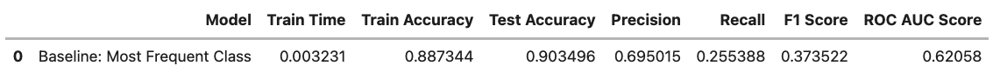
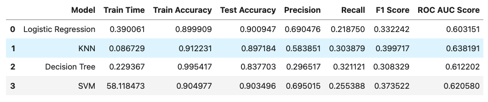
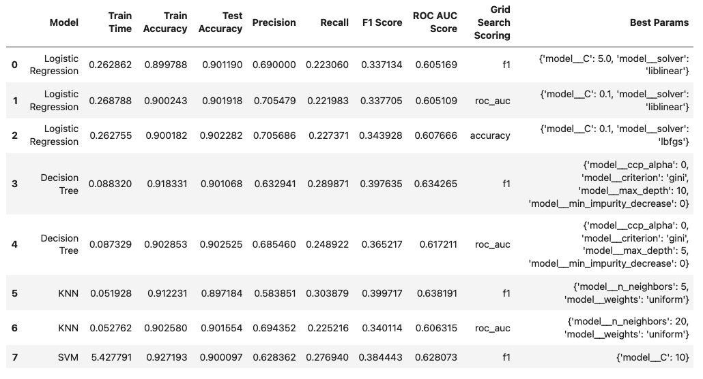

# Bank Marketing Analysis

## Overview

For this assignment, our goal is to analyze Portuguese Bank data from the following UCI Machine Learning Repository: [link](https://archive.ics.uci.edu/ml/datasets/bank+marketing). The data concerns 17 marketing campaigns the bank has run between May 2008 and November 2010. Their success metric for the marketing campaign is whether the client subscribes to a long-term deposit.

We want to compare the performance of 4 different models, analyzing the tradeoffs in various metrics such as training time and predictive performance.
1. Logistic Regression
2. Decision Trees
3. K Nearest Neighbors
4. Support Vector Machines

## Data Analysis

We were given the following 20 input features, where all the data was either numerical or categorical. The data was already given to us cleaned somewhat, as there were no missing values in any of the columns.


```
Input variables:
# bank client data:
1 - age (numeric)
2 - job : type of job (categorical: 'admin.','blue-collar','entrepreneur','housemaid','management','retired','self-employed','services','student','technician','unemployed','unknown')
3 - marital : marital status (categorical: 'divorced','married','single','unknown'; note: 'divorced' means divorced or widowed)
4 - education (categorical: 'basic.4y','basic.6y','basic.9y','high.school','illiterate','professional.course','university.degree','unknown')
5 - default: has credit in default? (categorical: 'no','yes','unknown')
6 - housing: has housing loan? (categorical: 'no','yes','unknown')
7 - loan: has personal loan? (categorical: 'no','yes','unknown')
# related with the last contact of the current campaign:
8 - contact: contact communication type (categorical: 'cellular','telephone')
9 - month: last contact month of year (categorical: 'jan', 'feb', 'mar', ..., 'nov', 'dec')
10 - day_of_week: last contact day of the week (categorical: 'mon','tue','wed','thu','fri')
11 - duration: last contact duration, in seconds (numeric). Important note: this attribute highly affects the output target (e.g., if duration=0 then y='no'). Yet, the duration is not known before a call is performed. Also, after the end of the call y is obviously known. Thus, this input should only be included for benchmark purposes and should be discarded if the intention is to have a realistic predictive model.
# other attributes:
12 - campaign: number of contacts performed during this campaign and for this client (numeric, includes last contact)
13 - pdays: number of days that passed by after the client was last contacted from a previous campaign (numeric; 999 means client was not previously contacted)
14 - previous: number of contacts performed before this campaign and for this client (numeric)
15 - poutcome: outcome of the previous marketing campaign (categorical: 'failure','nonexistent','success')
# social and economic context attributes
16 - emp.var.rate: employment variation rate - quarterly indicator (numeric)
17 - cons.price.idx: consumer price index - monthly indicator (numeric)
18 - cons.conf.idx: consumer confidence index - monthly indicator (numeric)
19 - euribor3m: euribor 3 month rate - daily indicator (numeric)
20 - nr.employed: number of employees - quarterly indicator (numeric)

Output variable (desired target):
21 - y - has the client subscribed a term deposit? (binary: 'yes','no')
```

To process the features for input into a machine learning model, two primary methods were taken
1. Standard scale the numerical features
2. One hot encode the categorical features

## Model Comparison

**Step 1: Baseline Model** 

We first want to have a baseline model to compare with - one that would just predict just the most common class label no matter what the input. For this dataset, the most common class label is y = 'no', so the baseline model will always predict that the customer will not subscribe to the long-term deposit.

 

**Step 2: Model Comparison with Default Hyperparameters**

Afterwards, we looked at various metrics for the 4 classifers with their default values

 

**Step 3: Model Comparison with GridSearchCV - Tuning HyperParameters**

Then, we looked at various metrics for the 4 classifiers when tuning and testing different hyperparameters with GridSearchCV

 

## Takeaways and Recommendations

* We want to perform better than the baseline model which has test accuracy of 0.903, F1 Score of .374 and ROC AUC Score of 0.621.
* The only model that performs better than that is the Decision Tree with test accuracy of 0.901, F1 Score of 0.398, and ROC AUC Score 0.634.
* Since the tree depth of the Decision Tree isn't too large (max-depth 10) and yields either similar or better metrics than all the rest of the models, it's the best choice. We can still have somewhat interpretable results and determine what features have the biggest influence because the tree isn't too big.
* KNN yields similar results to the other models, but since it's not as intepretable we will not choose it. 
* SVM takes significantly longer to train than any of the other models, and it doesn't yield significantly better results. One thing to note is that I wasn't able to test as many hyperparameters as I'd like because SVM training took too long - it was still running even when 30 minutes had elapsed when I had around 8 different combinations to try with 5-fold cross-validation. So, I tried 3 different combinations with 2-fold cross-validation to speed up the process. Thus, there's a potential for SVM to perform better than the decision tree model if the right hyperparameters are found.
* Some things to consider to improve SVM training time
   * Try to drop more columns, so the SVM doesn't need to train on as much data
   * Run the model on a machine with more resources
   * In addition to reducing columns, you can also consider dropping some rows as well to run on a subset of data